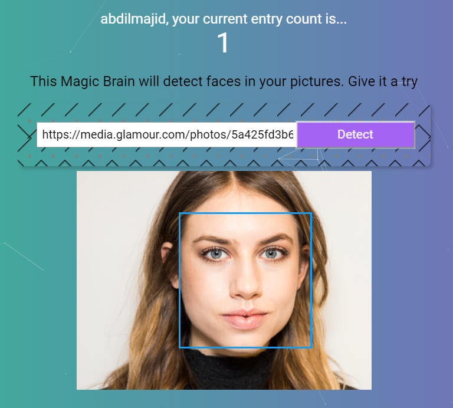

# **Face Recognition App**

> This is a Full Stack Application that uses React for the frontend, Node-Express and PostgreSQL for the backend

  

 

## Table of Contents
- [Synopsis](#Synopsis)
- [Tools Used](#tools-used)
- [Walkthrough ](#Walkthrough)

 

# **Synopsis**

This project is a simple face recognition app that uses the [Clarifai Api](https://clarifai.com) to find faces inside images. The [Clarifai Api](https://clarifai.com) is able to recognize multiple faces in images but this project is limited to only recognizing a single face inside an image. Users insert the URL of an image and the app tries to outline the face. 

# **Tools Used** 
>### ***Client Side***

>### ***Server Side***

<a href='https://www.npmjs.com/package/pg'>
 (Node-Postgres) </a>

>### ***Database***

 

>### ***Other Tools***

 
 

# **Walkthrough**

:star: The first page users see in the application is the **Sign In** page.

 

:star: If a user tries to sign in with an incorrect Email/Password, an error message will pop up, this also happens if the fields are empty when trying to sign in.

 

:star: Under the **Sign In** button there is a **Register** button that takes users to the registration page. 

 

:star: If the user tries to register with credentials that already exists, an error message pops up. 

 

:star: When a user submits the **Registration** form, the app sends that data to the server which inserts it to the database. The data is inserted into a login and user table. When the user first creates an account they enter a password which is stored as a hash. When the user tries to login again the server uses **BCRYPT** to validate the password.

 

:star: After the user is registered or signs in, they are taken to the main page. This page displays the users name as well as the number of submissions made. 

 

:star: After the user inserts an image url and clicks **Detect**, a blue box appears over the location of the face. When the user clicks the detect button, the app send the image to the **Clarifai** API which uses an AI to guess the location of the faces in an image. The data that is sent back from **Clarifai** is coordinate information which is mapped out using CSS. After every submission a counter increments, showing the number of submissions a user has made.

 

